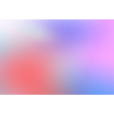

<h1 align="center">BlurHash Previewer</h1>

<p align="center">
  
<p>

Application for previewing BlurHash strings to images and converting images to BlurHash string.

This application is running in [https://youthful-euler-798f43.netlify.app/](https://youthful-euler-798f43.netlify.app/).

| [BlurHash](https://blurha.sh/) is a compact representation of a placeholder for an image

## BlurHash

In blurha.sh you can find more information for about BlurHash.

Also for encoding and decoding used 
- [React Blurhash](https://github.com/woltapp/react-blurhash)
- [Typescript Blurhash](https://github.com/woltapp/blurhash/tree/master/TypeScript)

## Example

You can find an example usage of BlurHash in a [Photo Album](https://gkampitakis.github.io/small-react-projects/#/photo-album) where images are provided by [Unsplash](https://unsplash.com).

You can also check [source code](https://github.com/gkampitakis/small-react-projects/tree/master/src/projects/photo_album) from photo album.

## Locally 

You can run it locally:

```bash 
# by cloning this repo 
git clone https://github.com/gkampitakis/blurhash-previewer.git

cd blurhash-previewer

#install dependencies
npm i

#start dev server
npm run start
```

<hr>

❓ [For any questions](https://github.com/gkampitakis/blurhash-previewer/discussions/categories/q-a)

❗ [For any issues](https://github.com/gkampitakis/blurhash-previewer/issues)
